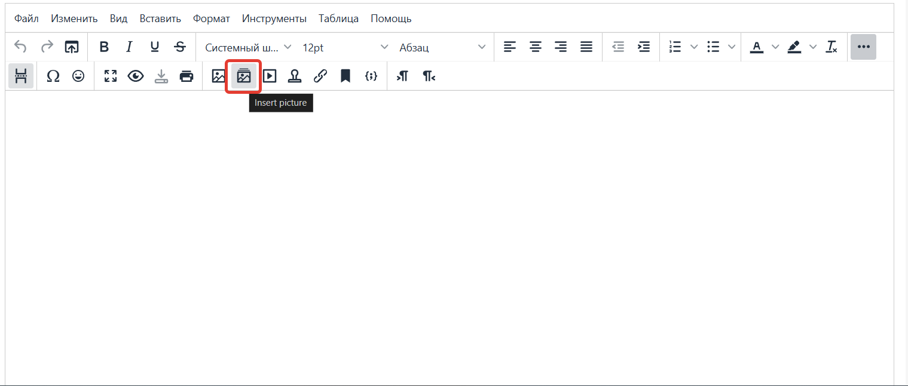
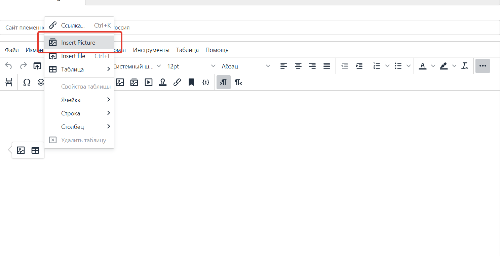
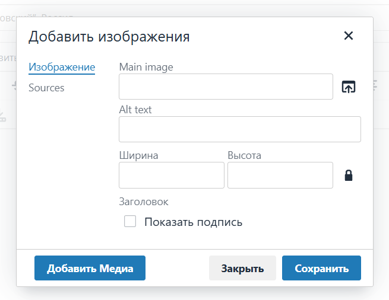
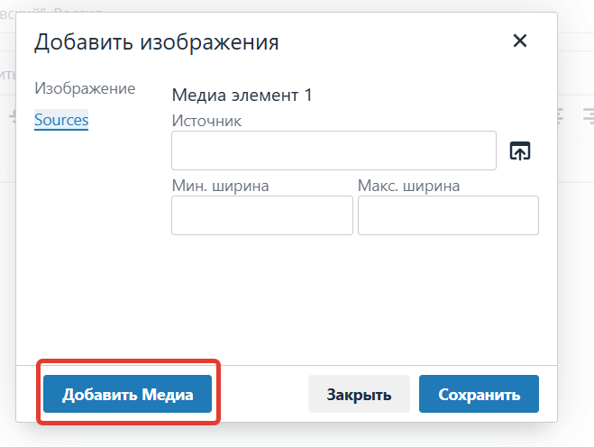

# Picture and Source Plugin for TinyMCE – Responsive Images in the Editor

Important!!!
1) The plugin has been tested on TinyMCE 5.2.1.
   It has not been tested on other versions, but it should easily adapt.

The `image_picture` plugin is designed to address this issue in the TinyMCE editor. It automatically adds support for the `<picture>` tag, which allows uploading different versions of images depending on the screen width. This makes your content more flexible and the pages faster to load.

#### 1. Instruction in English: [https://rband.pro/en/useful/scripts-plugins/tinymce-picture-plugin](https://rband.pro/en/useful/scripts-plugins/tinymce-picture-plugin)

---

# Плагин picture и source для TinyMCE – адаптивные изображения в редакторе
Важно!!!
1) Плагин протестирован на TinyMCE 5.2.1.
   На других версиях плагин не тестировался, но должен легко адаптироваться.

Плагин image_picture предназначен для решения этой проблемы в редакторе TinyMCE. Он автоматически добавляет поддержку тега <picture>, который позволяет загружать разные версии изображений в зависимости от ширины экрана. Это делает ваш контент более гибким, а страницы — быстрее загружаемыми.

#### 1. Иснтрукция на русском языке: [https://rband.pro/useful/scripts-plugins/tinymce-picture-plugin](https://rband.pro/useful/scripts-plugins/tinymce-picture-plugin)

# Picture i Source plugin za TinyMCE – Responsivna slika u editoru

---

Važno!!!
1) Plugin je testiran na TinyMCE 5.2.1.
   Na drugim verzijama plugin nije testiran, ali bi trebalo lako da se adaptira.

Plugin `image_picture` je dizajniran da reši ovaj problem u TinyMCE editoru. Automatski dodaje podršku za `<picture>` tag, koji omogućava učitavanje različitih verzija slika u zavisnosti od širine ekrana. Ovo čini vaš sadržaj fleksibilnijim, a stranice bržim za učitavanje.

#### 1. Uputstvo na ruskom jeziku: [https://rband.pro/sr/useful/scripts-plugins/tinymce-picture-plugin](https://rband.pro/sr/useful/scripts-plugins/tinymce-picture-plugin)

